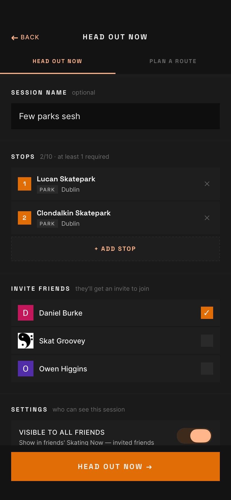
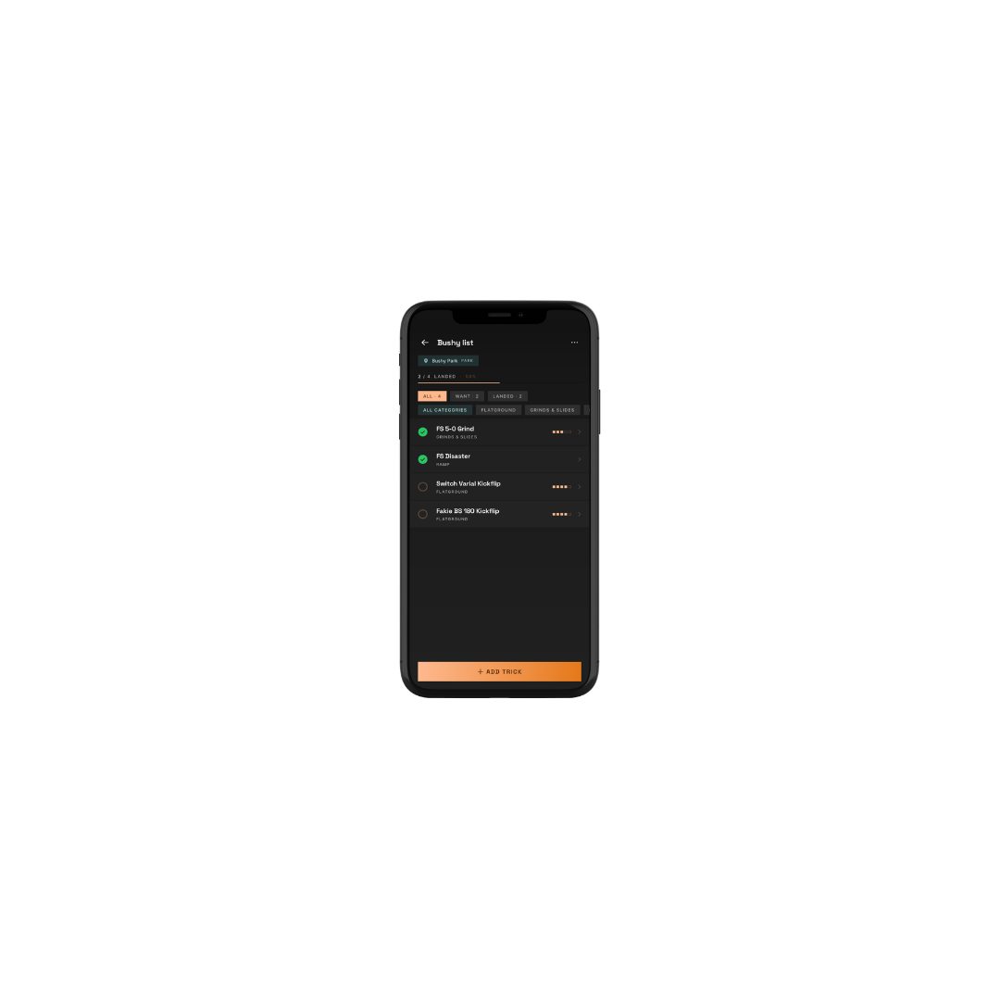
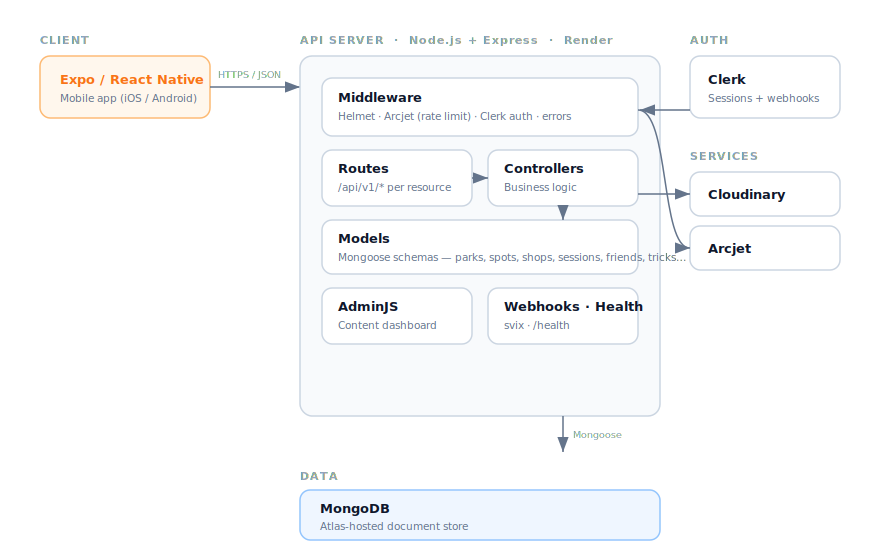

# Irish Skateboarding — Social Skateboarding App

A social skateboarding app for the island of Ireland. Skaters discover skateparks, shops, and street spots near them, save favourites, rate and check in to locations, and plan multi-stop skate sessions they can share with friends. A built-in trick library lets users track their progress.

Built with **Expo / React Native** on the front end and a **Node.js, Express, and MongoDB** backend, with Clerk authentication and a custom admin dashboard for content management. The app is deployed to production and actively maintained.

> This repository is a **public showcase**. The production source code is private and proprietary — I'm happy to walk through it on request. Get in touch via my [GitHub profile](https://github.com/DanielBurkeDev).

## Screenshots

<!--
  Add 3-4 phone screenshots to the /assets folder and update the paths below.
  A side-by-side row reads best for a mobile app. Delete rows you don't have.
-->

| Discover | Session | Tricks |
|:---:|:---:|:---:|
|  |  |  |
| Browse parks, shops, and street spots across Ireland, filterable by county and feature. | Plan a multi-stop session, invite friends, and check in at each stop as you go. | Track progress through a shared trick library and build personal, shareable lists. |

## Architecture



The system is a mobile client talking to a layered REST API, backed by MongoDB and a handful of managed services. Requests flow **route -> middleware (auth / rate limit) -> controller -> model**, with a single error-handling middleware translating database errors into consistent JSON responses.

## What it does

The backend serves a catalogue of skateparks, skate shops, and street spots across Ireland, and layers a full social and activity system on top of it:

- **Locations** — skateparks, skate shops, and user-submitted street spots, filterable by county and feature, with trending rankings.
- **Social graph** — friend requests (send / accept / decline / unfriend) and friend lists.
- **Sharing** — share spots, shops, events, and sessions into friends' inboxes, with unseen counts and seen-tracking.
- **Skate sessions** — multi-stop sessions with a full status lifecycle (draft -> active -> completed / cancelled), friend invites, join / leave, per-stop check-ins, and session copying.
- **Trick lists** — a shared trick library plus personal, shareable lists with per-trick progress tracking.
- **Ratings, likes & check-ins** — across locations and events, with aggregate and per-user lookups.
- **Events** — community events with trending, likes, and sharing.
- **Media** — image uploads via Cloudinary with signed uploads.
- **Admin dashboard** — a custom AdminJS panel for content management behind authenticated login.

## Engineering highlights

A few decisions I'd call out as the more interesting parts of the build:

- **Authentication via Clerk**, integrated for a React Native client — including handling the mobile-specific quirks of session verification and a webhook pipeline (svix-verified) that keeps the local user store in sync with Clerk.
- **Rate limiting and bot protection with Arcjet** at the middleware layer, plus Helmet for security headers.
- **A self-healing session lifecycle** — sessions left active beyond a threshold are auto-completed both on a startup sweep and lazily on read, so status stays accurate without a dedicated scheduled job. (A deliberate trade-off of read-time work against operational simplicity.)
- **Careful Express routing** — static routes ordered ahead of parameterised ones, and the webhook route mounted before the JSON body parser so signature verification receives the raw request body.
- **Centralised error handling** that translates Mongoose cast, duplicate-key, and validation errors into consistent JSON responses.
- **Production lifecycle** — graceful shutdown on SIGTERM, a health-check endpoint that reports database connection state, and infrastructure-as-code via a Render service definition.

## Project structure

A conventional layered structure, organised by resource:

```
app.js          # App setup, middleware, route mounting, AdminJS, server lifecycle
config/         # Environment and Arcjet configuration
constants/      # Static reference data (counties, features, amenities, tricks)
controllers/    # Request handling and business logic, one per resource
middlewares/    # Auth (Clerk), rate limiting (Arcjet), centralised error handling
models/         # Mongoose schemas
routes/         # Express routers, one per resource
adminui/        # AdminJS resource definitions and custom dashboard
```

## Tech stack

| Area | Technology |
|------|-----------|
| Client | Expo / React Native (iOS / Android) |
| Runtime | Node.js (>=20), ES Modules |
| Framework | Express 4 |
| Database | MongoDB via Mongoose 8 |
| Auth | Clerk |
| Rate limiting | Arcjet |
| Media | Cloudinary |
| Admin UI | AdminJS |
| Webhooks | svix (Clerk user sync) |
| Security | Helmet |
| Hosting | Render |

## Scope

This is a real, deployed product rather than a tutorial project: it serves a live mobile app, handles authentication and user data, and is built to be operated and maintained. It's an ongoing build, with subscription and additional moderation tooling among the next areas of work.

## Contact

Built by **Daniel Burke** — [github.com/DanielBurkeDev](https://github.com/DanielBurkeDev)

*The production source code is private and proprietary. Access for review is available on request.*
